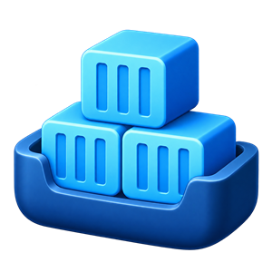

# Docklet



WSL 上の Docker Engine を Windows から操作する、WinUI 3 製のデスクトップアプリです。
C# の UI と Go 製の WSL エージェントを、標準入出力の JSON で接続します。

## できること

- Docker Engine のバージョン、コンテナー・イメージ・ボリューム・ネットワーク数の表示
- コンテナーの一覧、開始・停止、詳細・環境変数・ポート・マウントの表示
- コンテナーログの取得と文字列検索（ログ画面で `Ctrl+F`）
- 外部ターミナルからのコンテナーへの接続（`bash`、失敗時は `sh`）
- イメージ・ボリューム・ネットワークの一覧と削除
- 日本語・英語の表示切り替え

開発中のアプリです。ログは直近 1,000 行を取得し、リアルタイム追従は行いません。
大量のログや多数の検索一致がある場合の応答性は、引き続き改善対象です。

## ダウンロードと起動

GitHub の Releases から、Windows の CPU に合った ZIP をダウンロードしてください。

- x64: `Docklet-0.6.0-win-x64.zip`
- ARM64: `Docklet-0.6.0-win-arm64.zip`

ZIP をすべて展開し、フォルダー内の `Docklet.exe` を起動します。
.NET・Windows App SDK・WSL エージェントは同梱されます。WSL と Docker は別途必要です。
EXE だけを取り出さず、同梱の DLL・リソース・`agent` フォルダーを一緒に置いてください。
表示言語の設定は `%LOCALAPPDATA%\Docklet\language.txt` に保存されます。

## 必要な環境

開発は Windows 11 の x64 環境を想定しています。ARM64 のビルド設定もありますが、動作保証はしていません。

- Windows 用 [.NET 10 SDK](https://dotnet.microsoft.com/download/dotnet/10.0)
- Windows SDK（プロジェクトのターゲットは `10.0.26100.0`）と WinUI アプリをビルドできる開発環境
- Windows 用 [Go 1.27 以降](https://go.dev/dl/)（`go` が PATH にあること。各系列の最新パッチを推奨）
- [WSL 2](https://learn.microsoft.com/windows/wsl/install) と Linux ディストリビューション
- WSL の既定ディストリビューション内で動作する Docker Engine
- ターミナル接続を使う場合は、同じ WSL 内の Docker CLI
- Windows Terminal（任意。利用できない場合は WSL のコンソールを開きます）

Windows App SDK などの NuGet パッケージは復元時に取得されます。
Go エージェントはビルド時に Linux 向けへクロスコンパイルされるため、WSL 側に Go は不要です。

## WSL / Docker の準備

Docklet は WSL の**既定ディストリビューション・既定ユーザー**を使い、
`/var/run/docker.sock` へ接続します。ディストリビューションの選択、リモート Docker、
別パスの rootless Docker ソケットには現在対応していません。

PowerShell で次を実行すると、接続先と Docker の状態を確認できます。

```powershell
wsl --list --verbose
wsl -e docker --host unix:///var/run/docker.sock info
```

既定の WSL ユーザーに Docker ソケットへのアクセス権が必要です。
設定は [Docker の Linux インストール後の手順](https://docs.docker.com/engine/install/linux-postinstall/)を参照してください。
Docker ソケットへのアクセスは強い権限を伴います。ソケットを誰でも書き込める権限に変更しないでください。

初回起動時およびエージェントの再起動時に、同梱の実行ファイルを WSL の
`~/.docklet/docklet-agent` へ配置します。

## ビルドと起動

リポジトリを取得し、ルートディレクトリで実行します。

```powershell
dotnet restore Docklet.csproj -p:Platform=x64
dotnet build Docklet.csproj -c Debug -p:Platform=x64
dotnet run --project Docklet.csproj -p:Platform=x64
```

`dotnet run` では WinApp の MSBuild サポートが開発用のパッケージ ID を登録して起動します。
開発者モードや証明書の設定を求められた場合は、開発環境の案内に従ってください。

ARM64 を対象にする場合は `Platform=ARM64` と `RuntimeIdentifier=win-arm64` を指定します。
プロジェクトには x86 の設定も残っていますが、エージェントは Linux amd64 / arm64 向けです。

## 構成

| 場所 | 役割 |
| --- | --- |
| `Pages/` | WinUI の画面とイベント処理。文字表示は標準の WinUI コントロール |
| `Services/Docker/` | Docker 操作と表示用モデル |
| `Services/AgentClient.cs` | エージェントの起動と要求・応答の管理 |
| `Services/AgentDeployer.cs` | WSL へのエージェント配置 |
| `Services/TerminalLauncher.cs` | 外部ターミナルの起動 |
| `agent/methods/` | Go 側の操作ごとの処理 |
| `agent/internal/docker/` | Unix ソケット経由の Docker Engine API クライアント |
| `Strings/` | 日本語・英語のリソース |
| `Assets/` | アプリアイコンとパッケージ画像 |

## セキュリティと不具合報告

環境変数やログの内容は自動でマスクしません。
未処理例外は Windows の一時ディレクトリの `docklet-unhandled.log` に保存される場合があります。

通常の不具合報告には、OS・WSL・Docker のバージョン、操作手順、期待した動作を添えてください。
ログや環境変数、スクリーンショットに含まれるパスワード・トークン・個人情報は取り除いてください。
脆弱性の詳細は公開 Issue に書かず、管理者へ非公開の報告方法を確認してください。

## 公開・配布する場合

アプリのバージョンは `Docklet.csproj` の `<Version>0.6.0</Version>` で設定します。
設定画面と EXE のバージョン情報にも反映されます。
GitHub にソースと `.github/` を push した後、同じバージョンのタグを push すると、
GitHub Actions が x64・ARM64 の ZIP と SHA-256 一覧を作り、Release に公開します。

```powershell
git tag v0.6.0
git push origin v0.6.0
```

次回は `<Version>` を更新してコミットし、対応する新しいタグ（例: `v0.6.1`）を push します。
タグと `<Version>` が一致しない場合や、同じタグの Release がすでに公開済みの場合は処理を停止します。
ビルドは CPU ごとの matrix で実行し、両方の成功後に Release を公開します。
公開処理が途中で失敗してドラフトが残った場合は、そのドラフトを削除して Release ジョブを再実行します。

追加のトークンや署名証明書は不要です。ワークフローは GitHub の `GITHUB_TOKEN` を使います。
組織側で Actions や Release 作成を制限している場合は、その設定を調整してください。
ZIP は未署名です。

README・ライセンス類の同梱対象は `Docklet.csproj` に定義しています。
`dotnet publish` の出力の `licenses/` に NuGet・.NET・Go のライセンスと NOTICE を収録します。
[第三者ライセンス](THIRD_PARTY_NOTICES.md) も参照してください。

## ライセンス

Docklet の自作コードと本プロジェクトで作成したアイコンは [MIT License](LICENSE) で公開します。
依存パッケージ、ランタイム、OS のフォントなどには、それぞれのライセンスが適用されます。
Docklet は Docker または Microsoft の公式製品ではありません。
